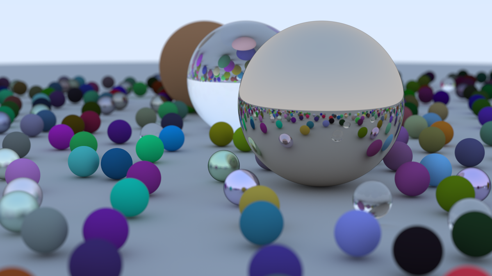
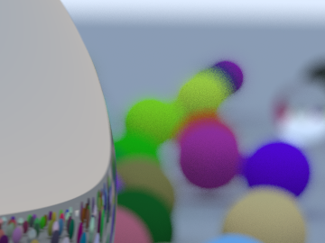

# Ray Tracing in One Weekend — in Inference

A from-scratch implementation of [*Ray Tracing in One Weekend*](https://raytracing.github.io)
(**book v4.0.2**, by Peter Shirley, Trevor David Black, and Steve Hollasch) in the [Inference](https://github.com/Inferara/inference-language-spec)
language, compiled to a single self-contained WebAssembly module — and a
standing **performance and correctness benchmark for the Inference toolchain**:
the renderer is a fixed workload, and every compiler snapshot gets a ledger row
(binary size, build time, rendering throughput, and an image-identity hash)
in [`bench/history.jsonl`](bench/history.jsonl).

The first Inference version of this renderer (June 2026; its module is
preserved as `bench/modules/main-v1-2026-06.wasm`) predates most of the
language. This rewrite uses what the toolchain gained since, and renders the
book's actual final scene — the ~480-sphere random field — rather than a
16-sphere approximation.



*2400×1350, 2000 samples/pixel, depth 50 — 6.48 G samples, rendered in 68
minutes on an Apple M5 Pro (17 threads) by the 9.5 KB `4f6738a` module, and
re-rendered pixel-identical under Inference v0.0.6 in 3 h 14 min by an 11.1 KB
module whose every integer `+`, `-` and `*` outside the RNG traps on overflow.
No floating point: the entire renderer is Q20.20 fixed-point arithmetic in
`i64`.*

## What the language gained since v1 (and how this project uses it)

| June 2026 (v1) | Today (v2) |
|---|---|
| Single file + external `.wasm` kernel linked via `[wasm-dependencies]` | **File-based module hierarchy** ([Inferara/inference#63](https://github.com/Inferara/inference/issues/63)): `src/{fx,rng,vec,sample,camera,materials,scene,main}.inf`, `use` imports, one self-contained artifact |
| No `/` operator — division via a hand-linked Newton-iteration kernel | **Native `/` and `%`** (wasm `i64.div_s`): exact fixed-point division everywhere |
| No unary minus (`0 - x` workarounds) | Unary `-`, `~` |
| Free functions only | **Struct methods** (`v.dot(w)`, `p.unit_vector()`, `Type::assoc()`) |
| No `break`; loops padded to fixed trip counts with `found` flags | `break` (rejection sampling and the bounce loop exit early) |
| Manual `let` for every constant | **Integer literals typed by context** ([Inferara/inference#219](https://github.com/Inferara/inference/issues/219)): `x < 0`, `clamp(gr, 0, CMAX)`, `return 0;`; fn-local `const` for named values |
| Whole-array literals only | **Array element writes** (`grid[i][j] = s`), computed indices, 2-D arrays |
| — | `infs` project mode ([Inferara/inference#222](https://github.com/Inferara/inference/issues/222)): `Inference.toml`, `infs build`, **`[build.wasm-opt]`** post-optimization (Binaryen -Os: 15.5 KB → 9.5 KB; level chosen by measurement, see bench/RESULTS.md) |
| — | Compiler safety rails: A036 stack-budget analysis, A041 shadowing rejection, dynamic bounds guards |
| — | **Read-only compound parameters passed by reference** ([Inferara/inference#220](https://github.com/Inferara/inference/issues/220)) and a configurable stack (`[memory]`): the nearest-hit scan is its own function over the 40 KB scene grid |
| — | **Trapping integer overflow** ([Inferara/inference#316](https://github.com/Inferara/inference/issues/316), v0.0.6): every integer `+`, `-` (binary and unary) and `*` in the renderer traps rather than wraps; splitmix64's three modulo-2^64 sites opt out with `wrapping(...)` |

## What the renderer itself fixes over v1

- **Q20.20 fixed point** (was Q16.16): 16× finer resolution (~9.5e-7). Q20 is
  the finest format that survives the final scene's radius-1000 ground sphere
  (`|oc|` ≈ 1030 ⇒ squared dot terms peak near 2^61 of the 2^63 budget).
- **Unit ray directions**: v1 divided the sphere quadratic by `1/|d|²` with
  ~8.6 significant bits (≈0.26 % error in every `t` — its largest single
  precision loss). One normalization per ray makes `a = 1`; no division in the
  hit test at all.
- **Sound RNG**: v1's i64 xorshift64 was non-bijective (arithmetic-shift
  sign-fill; it also carried a hard GF(2)-linear output invariant). v2 uses
  splitmix64 — Weyl state + two odd-constant multiplies — emulated bit-exactly
  in i64 with masked shifts, seeded per `(px, py, sample)`.
- **The real book scene**: the 22×22 procedurally generated sphere field with
  the book's material mix (80 % diffuse `rand*rand`, 15 % metal, 5 % glass),
  ground, and three hero spheres — 400+ live spheres per ray, scanned by one
  function that reads the 40 KB grid by reference.
- **v4 semantics** end to end: `oc = center − origin` sign convention,
  normalize-then-fuzz metal (draw consumed even at fuzz 0), defocus as a cone
  angle (`radius = focus · tan(defocus/2)`), centered pixel jitter,
  v4.0.1 `random_unit_vector` acceptance window, gamma-2 with the 0.999 clamp.

## Layout

```
Inference.toml     [package] + [build.wasm-opt] level s + [memory] 128 KiB stack
src/fx.inf         Q20.20 kernel: fixmul/fixdiv/recip/fixsqrt/clamp/pow5
src/rng.inf        splitmix64 (i64, masked logical shifts), per-sample seeding
src/vec.inf        Vec3 methods, cross/reflect/refract
src/sample.inf     unit-sphere / unit-disk rejection sampling
src/camera.inf     v4 camera; get_ray returns unit directions
src/materials.inf  lambertian / metal / dielectric scatter
src/scene.inf      per-cell-seeded random field + hero/showcase rows
src/main.inf       entry: render_pixel and the nearest-hit scan
tools/render.mjs   parallel driver (worker_threads), PNG writer, bench JSON
tools/downscale.mjs 2x2 box downscale in linear light (supersampled renders)
bench/             benchmark matrix, ledger (history.jsonl), saved results
web/               browser viewer (unchanged ABI)
tests/             Playwright smoke test for the web viewer
assets/            README figures (image-identity comparison)
out/               build output + preserved renders (incl. be1d239 versions)
```

## ABI (unchanged from v1 — one driver runs both)

```
render_pixel(px, py, width, height, samples, depth, scene) -> i64  // 0x00RRGGBB
abi_version() -> i64                                               // 2
```

`scene`: `0` = the v1 three-material showcase (kept for head-to-head
benchmarking), `1` = the book final scene.

## Build & render

Requires the Inference toolchain
[v0.0.6](https://github.com/Inferara/inference/releases/tag/v0.0.6) or newer
(`infs` and `infc`); earlier releases reject `wrapping(...)`. The
`[build.wasm-opt]` step needs Binaryen: `infs component add wasm-opt`.

```bash
infs build                          # or: INFC_PATH=... infs build
node tools/render.mjs --wasm out/main.wasm --out out/final.png \
     --width 1200 --height 675 --scene 1 --spp 500 --depth 50
bash bench/run.sh                   # reproduce the benchmark matrix
```

Determinism: every sample is seeded from `(px, py, sample)` inside the wasm,
so thread count never changes the image.

## Benchmarks & toolchain tracking

See [`bench/RESULTS.md`](bench/RESULTS.md) for numbers and
`bench/results/*.json` for raw runs (wasm SHA-256, host info, toolchain
commit).

The longitudinal ledger is [`bench/history.jsonl`](bench/history.jsonl):
one JSON row per compiler snapshot, appended by

```bash
INFS=<path>/infs INFC_PATH=<path>/infc REF=<prior-module> bash bench/snapshot.sh
```

which builds the renderer, records the toolchain (`infc --version` and
`--commit-hash`), size/build-time/throughput, and — when `REF` is set —
re-benchmarks that prior module *interleaved* with the new one, so every row
carries a same-conditions baseline instead of a stale absolute number.
Preserved modules live in `bench/modules/`.

### The image-identity canary

Each ledger row includes the SHA-256 of a small deterministic render
([`bench/identity.sh`](bench/identity.sh)) — a value that moves only when
codegen *semantics* do. When it changes between two toolchain snapshots, the
rendered image changed too; what changed in the compiler is in its own git
history between those commits. `identity_rgb_sha256` hashes the decoded image
data and is the same on every host; `identity_sha256` hashes the PNG file,
whose compressed bytes also depend on the zlib build of the Node that wrote
it, so compare it only between rows taken with the same Node.

CI ([`.github/workflows/canary.yml`](.github/workflows/canary.yml)) builds
the renderer with two released toolchains — the one the latest ledger row was
taken with, and the newest release — and fails if either renders a different
image. Under the ledger's toolchain it also requires the committed
`out/main.wasm` and `web/main.wasm` to be exactly what `src/` builds to. It runs
on every push and pull request and weekly, so a new release that breaks this
source or changes its image shows up without anyone rebuilding by hand.

It has already moved once. Toolchains `be1d239` and `4f6738a` render this scene
differently:

| be1d239 | 4f6738a | difference ×8 |
|---|---|---|
|  |  |  |

At 2000 spp / depth 50 the two differ across **34.1 % of pixels**, strictly
one-sided (of 9.72 M channel values, none are brighter under `4f6738a`), at no
throughput cost. Full-frame difference, amplified ×8:


The `be1d239` renders are preserved in `out/*-be1d239.png`; measured deltas are
in [`bench/RESULTS.md`](bench/RESULTS.md), and the compiler changes between the
two toolchains are at
[`Inferara/inference@be1d239...4f6738a`](https://github.com/Inferara/inference/compare/be1d239...4f6738a).

## License

Apache-2.0 (see [LICENSE](LICENSE)). The *Ray Tracing in One Weekend* book and
its reference C++ code are CC0 public domain; this implementation is
independent code that follows the book's algorithms.
